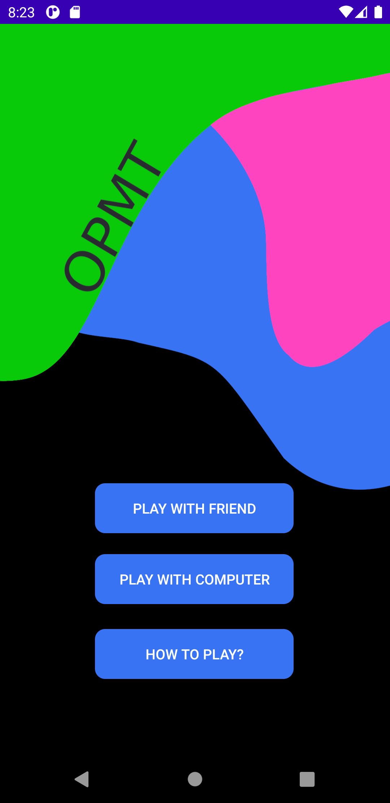
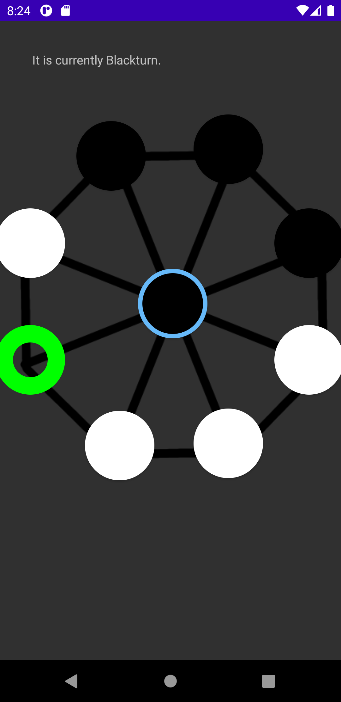

# OPMT
An android board game that is similar to Mū tōrere, a board game from New Zealand.

## How to play
  * The black pieces go first.
  * You can only move to the empty space, you cannot take pieces or jump over them.
  * If a piece of your is surronded by your own, you cannot move that piece.
  * You win when your opponet is unable to make a move.

## Todo
 - [ ] Make a stronger AI
